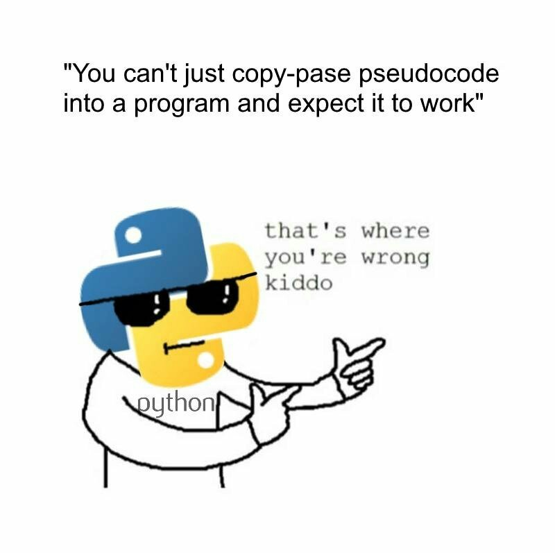
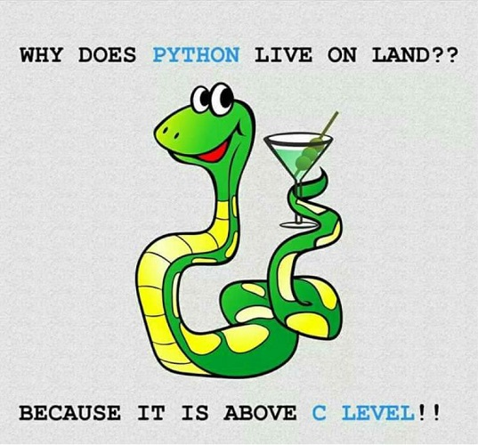

<h1>
In The Name Of ALLAH
</h1>
<h2>
Advanced Programming - Homework 7
</h2>
<h2>
Dr.Amir Jahanshahi
</h2>
<h3>
Deadline: Friday, 19 Dey - 23:00

# Introduction
This homework is so simple! Just write a code that simulates your midterm project with a beautiful animation. You can see an example in **APHW7.wmv**. You should solve the puzzle in your animation. The more beautiful your animation, the more bounus points you earn! You must use **dll**s to use your midterm project code (written in c++) to solve the puzzle in python.

**Note**: For any student, not completed his/her midterm project in c++, he/she can do it in python with the cost of some points!

